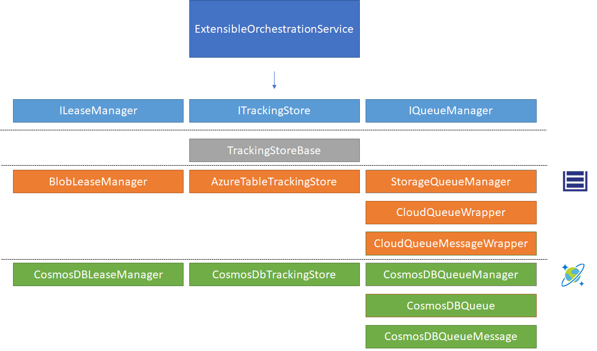
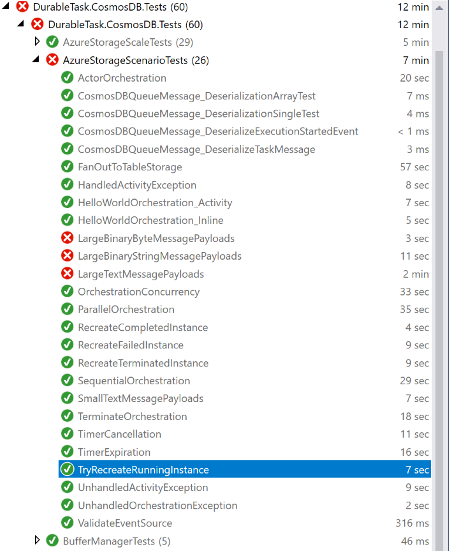

---    
Copyright Microsoft Corporation
Licensed under the Apache License, Version 2.0 (the "License");
you may not use this file except in compliance with the License.
You may obtain a copy of the License at
http://www.apache.org/licenses/LICENSE-2.0
Unless required by applicable law or agreed to in writing, software
distributed under the License is distributed on an "AS IS" BASIS,
WITHOUT WARRANTIES OR CONDITIONS OF ANY KIND, either express or implied.
See the License for the specific language governing permissions and
limitations under the License.
---
# Adding Cosmos DB Provider to Durable Framework

This document describes the work we have done during Sync Week (+ a few days later). Participants in this project are Bindukaladeepan Chinnasamy, Francisco Beltrao, Luis Guerrero Guirado, Kanio Dimitrov, Steve Bohlen and Sarath Pinninty.

## The Start

We started off by discussing approachs to deal with the problem. We agreed that we should work on the Durable Tasks framework and not in the Durable Functions repository. The durable framework was new to most of us, therefore we decided to start working with a clone of the DurableTask.Emulator since it is the simpliest implementation possible.

After working for about 1.5 days on it, the framework became familiar to the team. At this point we also realized that the project DurableTask.AzureStorage had many functionality that we should reproduce in our implementation (started based on the Emulator project), such as:

- Usage statistics
- Scaling
- Handling of lease changes

The team decided that a better approach would be to profit from the existing logic in DurableTask.AzureStorage project adding the required extensibility to include custom providers.

## Refactoring DurableTask.AzureStorage


Our first step was to extract the storage specific code from AzureStorageOrchestrationService by introducing abstractions. To accomplish that we copied the projects DurableTask.AzureStorage and DurableTask.AzureStorage.Tests renaming them with "CosmosDB". Next, we added interfaces to the dependency on azure storage classes, renaming the class to ExtensibleOrchestrationService.

The following abstractions were used:

- **ITrackingStore** (existing): we added the CosmosDbTrackingStore implementation
- **ILeaseManager** (existing): we added the CosmosDBLeaseManager implementation
- **IPartitionManager** (existing): we made changes to the existing PartitionManager&lt;T&gt; to not dependend on ILeaseManager&lt;T&gt; but on ILeaseManager, allowing the ExtensibleOrchestrationService to implement IPartitionObserver instead of IPartitionObserver&lt;BlobLease&gt;
- **IQueueManager** (new): Handles the control and work items queues. Extracted current implementation to StorageQueueManager and created new CosmosDBQueueManager
- **IQueue** (new): Enqueue/dequeue items from a queue. Extracted current implementation to CloudQueueWrapper and created new CosmosDBQueue
- **IQueueMessage** (new): Defines the contract of a queue message. Extracted current implementation to CloudQueueMessageWrapper and created new CosmosDBQueueMessage



### Queue in Cosmos DB

The usage of the IQueueManager or IQueue are based on polling. The orchestration service will, on a interval basis, ask for pending messages. After processing them they will be either completed or abandoned based on the execution success.

The CosmosDB implementation creates an envelope for queue items that indicates the queue they belong to, current status and visibility. A stored procedure will dequeue items based on the creation time, making an atomic update to prevent items from being dequeued multiple times.

```json
{
    "$type": "DurableTask.CosmosDB.Queue.CosmosDBQueueMessage, DurableTask.CosmosDB",
    "CreatedDate": 1526283825,
    "NextVisibleTime": 1526283825,
    "LockedUntil": 0,
    "id": "12483f10-2c01-4edc-a41b-22648e1fcc08",
    "DequeueCount": 0,
    "Data": {
        "$type": "DurableTask.AzureStorage.MessageData, DurableTask.CosmosDB",
        "ActivityId": "0811c6b8-79c8-48fb-9810-93eef3d68f12",
        "TaskMessage": {
            "$type": "DurableTask.Core.TaskMessage, DurableTask.Core",
            "Event": {
                "$type": "DurableTask.Core.History.ExecutionStartedEvent, DurableTask.Core",
                "OrchestrationInstance": {
                    "$type": "DurableTask.Core.OrchestrationInstance, DurableTask.Core",
                    "InstanceId": "c339909d6559416d8d06785a6ff4c7e1",
                    "ExecutionId": "cc65983407a04d52a4bcf46ac87efe0e"
                },
                "EventType": 0,
                "ParentInstance": null,
                "Name": "DurableTask.CosmosDB.Tests.AzureStorageScenarioTests+Orchestrations+SayHelloWithActivity",
                "Version": "",
                "Input": "\"World\"",
                "Tags": null,
                "EventId": -1,
                "IsPlayed": false,
                "Timestamp": "2018-05-14T07:43:44.7507648Z"
            },
            "SequenceNumber": 0,
            "OrchestrationInstance": {
                "$type": "DurableTask.Core.OrchestrationInstance, DurableTask.Core",
                "InstanceId": "c339909d6559416d8d06785a6ff4c7e1",
                "ExecutionId": "cc65983407a04d52a4bcf46ac87efe0e"
            }
        },
        "CompressedBlobName": null
    },
    "Status": "Pending",
    "QueueName": "testhub-control-00"
}
```

Dequeing Stored Procedure (simple version)
```javascript
/*
    @batchSize: the amount of items to dequeue
    @visibilityStarts: visibility starting datetime
    @lockDurationInSeconds: how long a dequeue item should be locked for
    @queueName: queue name to dequeue from
*/
function dequeueItems(batchSize, visibilityStarts, lockDurationInSeconds, queueName) {
    var collection = getContext().getCollection();

    var currentDate = Math.floor(new Date() / 1000);
    var dequeuedItemLockUntil = currentDate + lockDurationInSeconds;
    var searchItemsLockUntil = Math.floor(currentDate + (lockDurationInSeconds / 2));
    var itemsToReturn = [];
    var foundItemsCount = 0;
    var processedItemsCount = 0;

    var query = {
        query: 'SELECT TOP ' + batchSize + ' * FROM c WHERE c.NextVisibleTime <= @visibilityStarts AND c.QueueName = @queueName AND ((c.Status = "Pending") OR (c.Status="InProgress" AND c.LockedUntil > @searchItemsLockUntil)) ORDER by c.NextVisibleTime',
        parameters: [
            { name: "@queueName", value: queueName },
            { name: "@visibilityStarts", value: visibilityStarts },
            { name: '@searchItemsLockUntil', value: searchItemsLockUntil }]
    };

    collection.queryDocuments(
        collection.getSelfLink(),
        query,
        function (err, feed, options) {
            if (err) throw err;

            if (!feed || !feed.length) {
                var response = getContext().getResponse();
                response.setBody('[]');
                return response;
            }

            foundItemsCount = feed.length;

            updateDocument(feed, 0);

        }
    );

    function updateDocument(docs, index) {
        var doc = docs[index];
        doc.Status = 'InProgress';
        doc.DequeueCount = doc.DequeueCount + 1;
        doc.LockedUntil = dequeuedItemLockUntil;

        collection.replaceDocument(
            doc._self,
            doc,
            function (err, docReplaced) {
                if (!err) {
                    itemsToReturn.push(docReplaced);
                }

                ++processedItemsCount;

                if (processedItemsCount == foundItemsCount) {
                    var response = getContext().getResponse();
                    response.setBody(JSON.stringify(itemsToReturn));
                } else {
                    updateDocument(docs, index + 1);
                }
            }
        );
    }
}

```

### Lease management in Cosmos DB

Lease management in Durable Tasks Framework is used to identity which node/host is responsible for a control queue (by default 4). The implementation is Cosmos creates 1 document for each lease. Using conditional updates (by ETag) we identify which host has control over it.

```json
{
    "id": "testhub-control-00",
    "TaskHubName": "test",
    "LeaseTimeout": 1526280706,
    "PartitionId": "testhub-control-00",
    "Owner": "DESKTOP-FBB",
    "Token": "\"00000000-0000-0000-eb4f-ee670b8d01d3\"",
    "Epoch": 5
}
```

### Validating the implementation

To verify that our code refactory and new implementations work as intended we use the existing unit tests. We made a few changes so that the tests methods can be executed twice, once for each provider:

```c#
        /// <summary>
        /// End-to-end test which runs a simple orchestrator function that calls a single activity function.
        /// </summary>
#if !DISABLE_STORAGE_TESTS
        [DataRow(OrchestrationBackendType.Storage)]
#endif
        [DataRow(OrchestrationBackendType.CosmosDB)]
        [TestMethod]
        public async Task HelloWorldOrchestration_Activity(OrchestrationBackendType orchestrationBackendType)
        {
            using (TestOrchestrationHost host = TestHelpers.GetTestOrchestrationHost(orchestrationBackendType: orchestrationBackendType))
            {
                await host.StartAsync();

                var client = await host.StartOrchestrationAsync(typeof(Orchestrations.SayHelloWithActivity), "World");
                var status = await client.WaitForCompletionAsync(TimeSpan.FromSeconds(30));

                Assert.AreEqual(OrchestrationStatus.Completed, status?.OrchestrationStatus);
                Assert.AreEqual("World", JToken.Parse(status?.Input));
                Assert.AreEqual("Hello, World!", JToken.Parse(status?.Output));

                await host.StopAsync();
            }
        }
```

We realized that unit tests don't work always (for both Storage and Cosmos). The problem seems to be related to parallelism and the emulated Storage and Cosmos. Running the faulty tests cases individually usually solves the problem.



## Known Issues

- Large payloads are not working for CosmosDB provider. Implementation started using CosmosDB attachments (since documents have a hard limit of 2MB). Not finalized due to time constraints.
- Durable functions were never tested against the new orchestration implementation
- CosmosDB usage is limited to 1 collection per subject (leases, queues, instances, instance histories). We discussed about creating a partition for each document type in order to reduce costs for customers using CosmosDB provider.
- The project DurableTask.CosmosDB still uses the namespace DurableTask.AzureStorage. We haven't invested time to fix it because we are not sure about the project's future.
- CosmosDB dequeue is currently not returning items with expired locking.